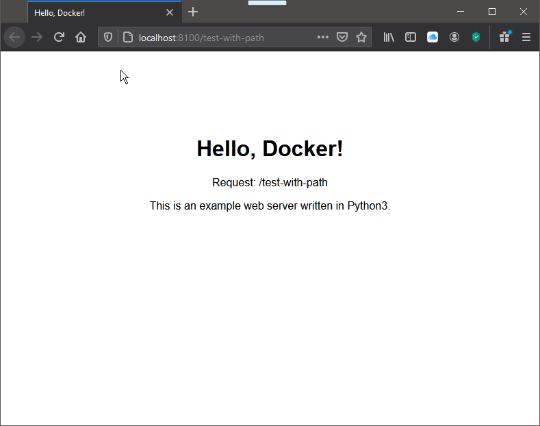

# hello-docker

A little Docker demo for a webserver written in Python3.

docker build -t hello-docker:latest -t hello-docker:0.2.3 .

http://localhost:8100/

Containers for AMD64 and ARM64:
https://hub.docker.com/r/stefanj9/hello-docker
